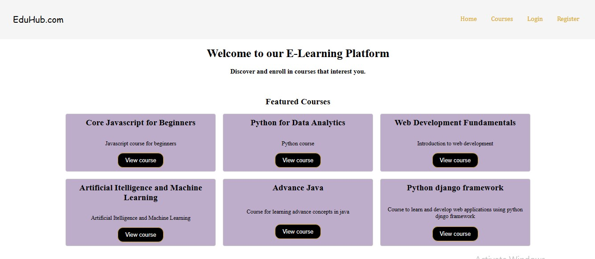

# E-Learning Platform

## Overview

The E-Learning Platform is a web application developed using PHP (CodeIgniter) and MySQL. It provides a dynamic and user-friendly environment for users to engage in educational content.

## Features

- User authentication and authorization for secure access.
- Course modules with video content.
- Tracking user progress in course modules.
- Responsive and intuitive user interface.
- Integration with XAMPP for MySQL database management.

- **HOMEPAGE**
  

- **LOGIN**
  

- **REGISTER**
  

- **STUDENT DASHBOARD**
  

- **ENROLLED COURSES**
  

- **CHANGE PASSWORD**
  

- **ADD COURSE**
  

- **ADD MODULE**
  

- **INSIGHTS**
  
  
## Technologies Used

- PHP (CodeIgniter)
- MySQL
- HTML, CSS, JavaScript
- XAMPP server for local development

## Setup Instructions

1. Clone the repository to your local machine.
2. Import the database (`eLearning.sql`). Email for database file.
3. Configure the database settings in CodeIgniter (`application/config/database.php`).
4. Run the application using a local server (e.g., XAMPP).

## Usage

1. Register or log in to access the courses.
2. Explore featured courses or enroll in specific modules.
3. Track your progress through video modules.
4. Register as recruiter and post courses for students.
5. Enjoy an interactive learning experience.
6. View students records in insight section.

## License

This project is licensed under the [MIT License](LICENSE).

## Contributing

Contributions are welcome! Feel free to submit issues or pull requests.

## Contact

For any inquiries, please contact Asif Sayyed at [asifsayyed0502@gmail.com].

